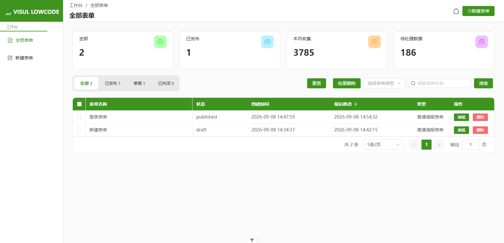
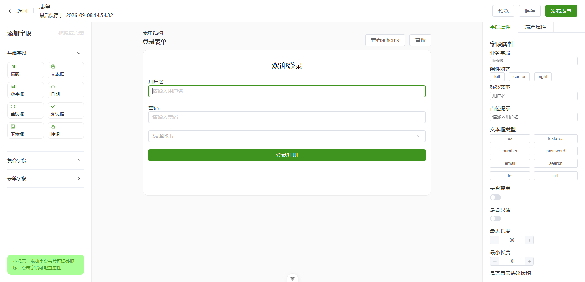
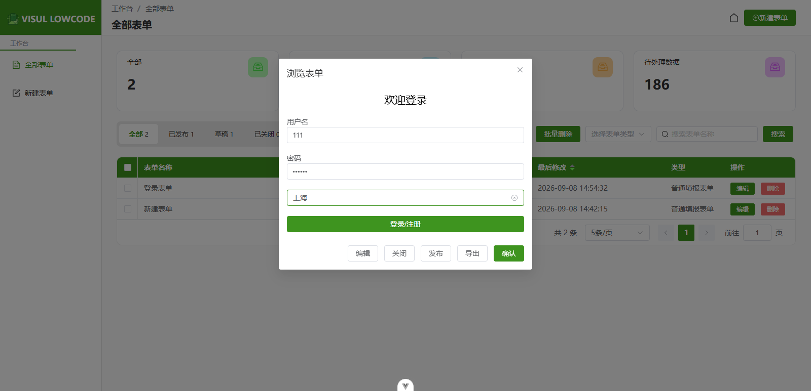

# 可视化低代码配置平台 v1.1.0

## 项目简介

轻量化可视化低代码配置平台，一期实现可视化表单搭建、基础管理与导出能力。通过拖拽方式快速构建业务表单，支持导出 JSON Schema 供外部系统渲染使用，同时预留后续组件、图表、页面扩展能力。

## 项目功能

### 表单设计器

- 三栏布局：左侧物料库 → 中间画布 → 右侧属性面板
- 拖拽搭建：物料库组件点击或拖拽到画布，画布内拖拽排序
- 属性编辑：选中组件后右侧面板修改属性，实时生效
- 组件操作：选中、复制、删除、查看 Schema
- 状态管理：保存草稿 / 发布（草稿可多次编辑，发布后对外生效）
- 实时预览：弹窗预览表单效果

### 全部表单页

- 全部表单 / 已发布 /草稿/已关闭 Tab 切换
- 筛选：表单编号、表单名称模糊搜索、表单类型
- 分页展示，默认按更新时间倒序
- 操作：新增、编辑、单条/批量删除、浏览预览

### 表单导出

- 导出 JSON Schema 配置文件，外部系统读取后配合渲染组件使用

### 基础物料组件

| 组件    | 类型标识            |
| ----- | --------------- |
| 标题    | `title`         |
| 文本框   | `input`         |
| 数字框   | `inputNumber`   |
| 日期    | `date`          |
| 单选框   | `radio`         |
| 多选框   | `checkbox`      |
| 下拉框   | `select`        |
| 单选框组  | `radioGroup`    |
| 多选框组  | `checkboxGroup` |
| 按钮    | `button`        |
| 评分    | `rate`          |
| 颜色选择器 | `colorPicker`   |

## 技术栈

| 技术               | 用途       |
| ------------------ | ---------- |
| Vue 3              | 前端框架   |
| Vue Router         | 路由管理   |
| Pinia              | 状态管理   |
| Element Plus       | UI 组件库  |
| Vite               | 构建工具   |
| Vue-Draggable-Plus | 拖拽排序   |
| Axios              | HTTP 请求  |
| Mock.js            | 接口 Mock  |
| SCSS               | 样式预处理 |
| TypeScript         | 类型安全   |

## 项目预览







## 快速开始

### 环境要求

- Node.js >= 22.18.0

### 安装与运行

```bash
# 安装依赖
npm install

# 启动开发服务器（含 Mock 接口）
npm run dev

# 构建生产版本
npm run build

# 预览生产构建
npm run preview
```

## 提交规范

遵循 Conventional Commits 规范，格式：

```
<type>(<scope>): <subject>
```

**类型**：`feat` | `fix` | `docs` | `style` | `refactor` | `perf` | `test` | `chore`

**示例**：

- `feat(canvas): 实现sortable组件拖拽排序`
- `feat(form): 新增表单保存导出功能`
- `fix(schema): 修复组件属性回写丢失问题`
- `refactor: 抽离schema解析公共工具函数`


## 更新日志
### v1.1.0（Bug修复版本）
> 主要改动：移除原生 Sortable.js，升级拖拽库为 `vue‑draggable‑plus`，修复画布模块多个核心问题

####  Bug修复
1. **【核心修复】画布多次交叉拖拽排序，Schema数组数据正确，但页面DOM视图偶现错乱**
    - 根因：原生 Sortable.js 会直接永久修改真实DOM，DOM改动先于数据更新，和Vue3 diff最长递增子序列(LIS)节点复用逻辑产生冲突；前期`nextTick`、数组副本优化仅能降低复现概率，无法彻底解决。
    - 解决方案：替换为`vue‑draggable‑plus`。拖拽仅做临时镜像预览，松手撤销Sort对列表DOM的改动；只更新响应式数组，页面DOM完全由formSchema数据驱动，从根源消除数据‑视图不一致。

2. **UI样式修复**
    - 修复物料区grid布局，统一基础字段、复合字段卡片宽度；

#### 依赖变更
- 移除：`sortablejs`
- 新增：`vue‑draggable‑plus`

